# Tennis Pose Estimation Analysis System

Build a Deep Learning Tennis Pose Estimation System using YOLO11, PyTorch and Key Point Extraction.

## Overview

This project implements a using computer vision and deep learning  for tennis pose estimation using object detection, multi-object tracking and the result of this is the player pose estimation. The system is designed to detect players, ball, and the court over the time and extract biomechanical key points for analysis.

<div style="text-align: center;">
  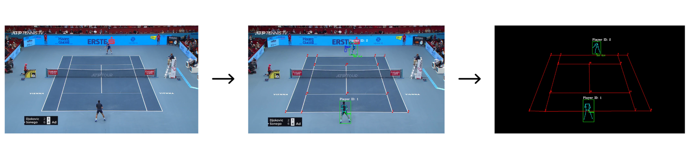
</div>

## Project structure

```plaintext
Tennis-Analysis/
│── data/                # Datasets and raw data
│── docs/                # Project documentation
│── models/              # Exploration or download models Notebooks
│── notebooks/           # Jupyter notebooks for exploration
│── tennis_yolo/         # Source code
│   ├── court/           # Court keypoint detection
│   ├── pose_estimation/ # Player pose estimation
│   ├── tracking/        # Object tracking
│   ├── training/        # Training Notebooks for YOLO
│   ├── utils/           # Utility functions
│   └── main.py          # Main function
│── README.md            # Project README
```
## Features

### Players and Ball Detection

The system starts by detecting the players and the ball using YOLOv11 model.

<div style="text-align: center;">
  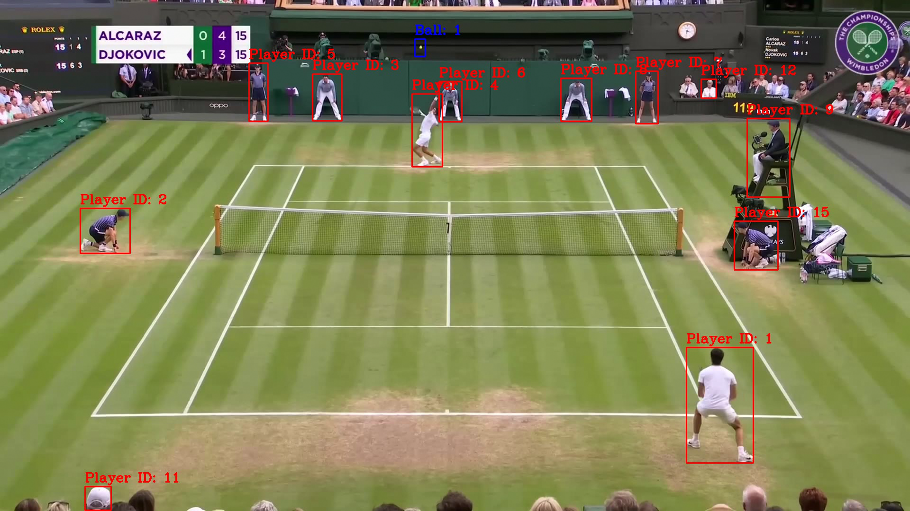
</div>

### Court Detection

Next, the court is detected by identifying its keypoints. For now, the court is predicted from the first frame only, but the objective is to extend this to the full video.

<div style="text-align: center;">
  
</div>

After predicting the raw court points, we refine them using classical computer vision techniques (you can read about this in the notebook postProcessing_court.ipynb)

<div style="text-align: center;">
  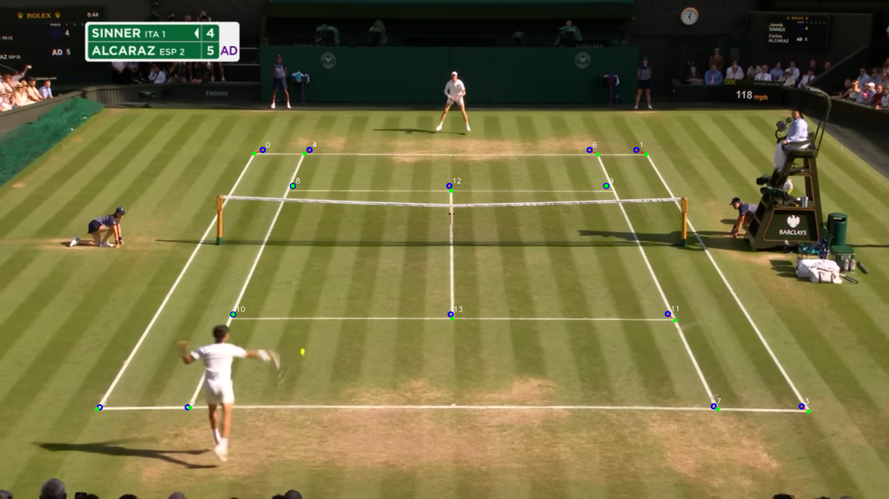
</div>

The refined result is more stable and precise.

<div style="text-align: center;">
  
</div>

Finally, we use the Convex Hull to generate the court polygon.

<div style="text-align: center;">
  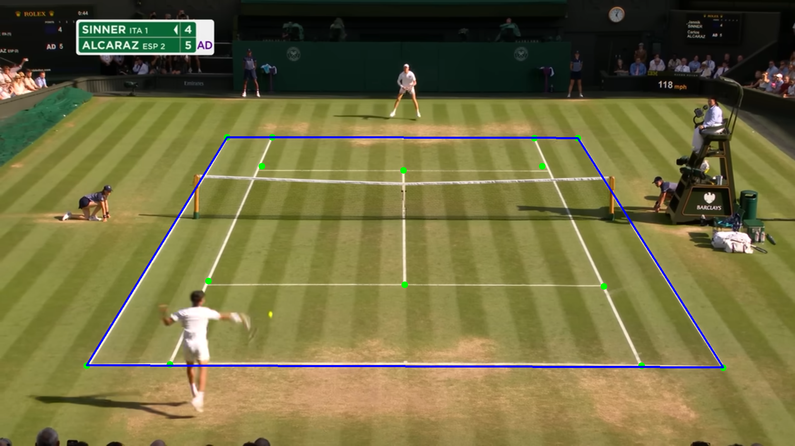
</div>

### Player Selection Near the Court

From all detected players, we select only those within or near the court polygon. This step ensures we discard referees, spectators, or irrelevant detections.

<div style="text-align: center;">
  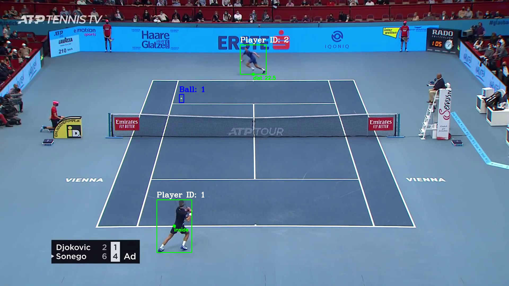
</div>

### Pose Estimation 

With the players filtered, we estimate their body pose using a YOLO11-pose model. This provides a set of biomechanical landmarks for each frame.

<div style="text-align: center;">
  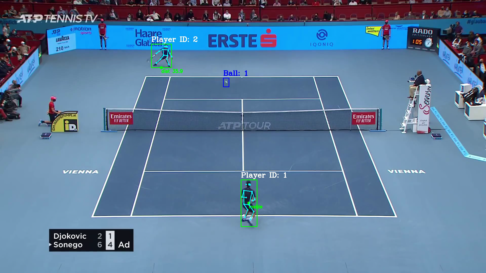
</div>

But the raw pose predictions contain noise (eyes, ears and nose), so, we apply post-processing to clean the keypoints.

<div style="text-align: center;">
  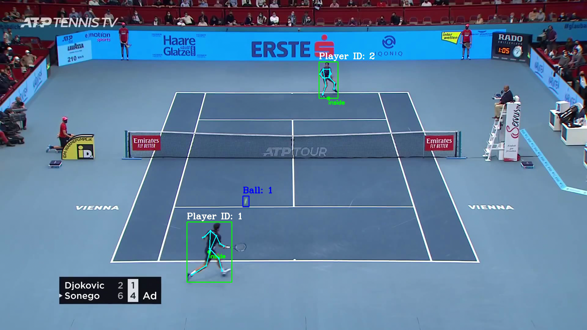
</div>

### Output Video

Finally, we generate the output video by drawing the refined results (players, ball, court, and poses). For clarity, everything is rendered over a black background, highlighting only the essential information.

<div style="text-align: center;">
  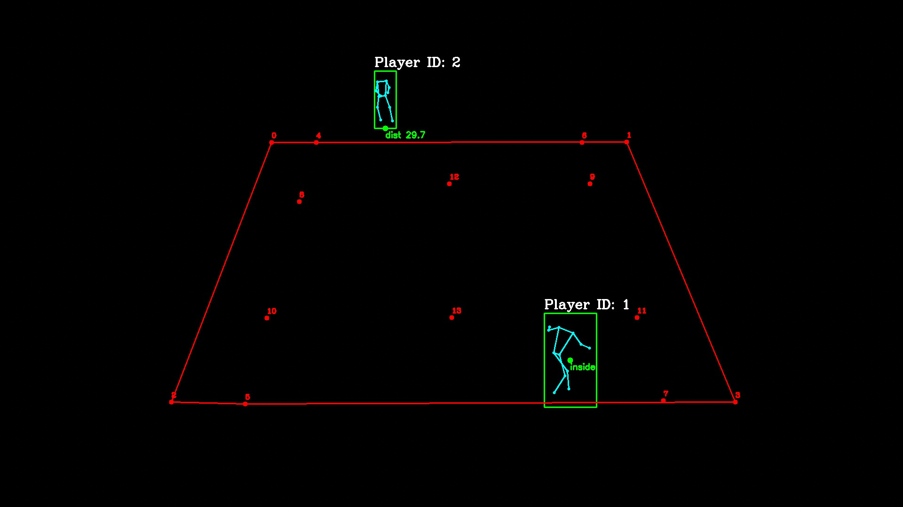
</div>

## Examples

Example of the project

| Raw Video | Keypoints | Black Background |
|-----------|-----------|------------------|
| 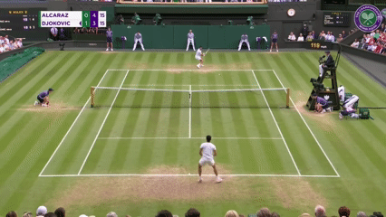 | 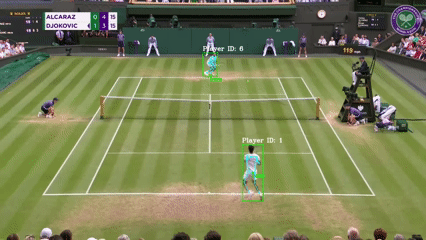 | 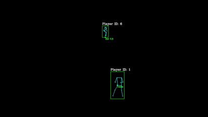 |
| 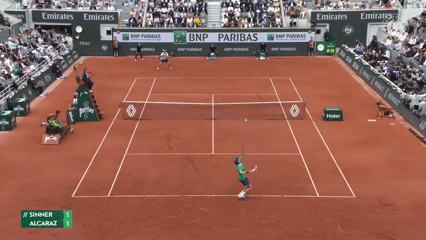 | 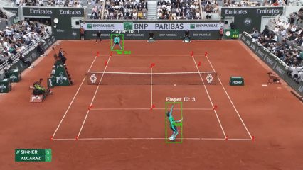 | 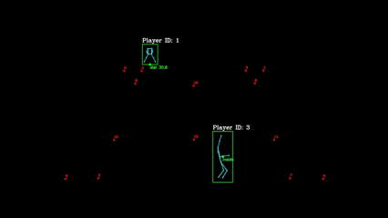 |
| 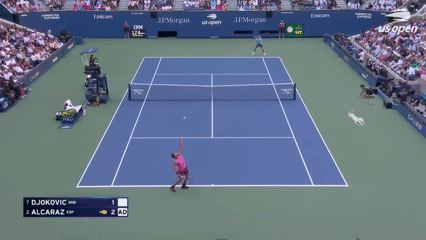 | 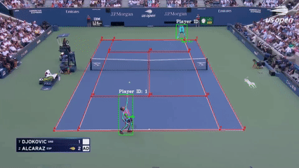 | 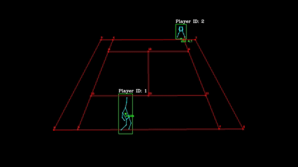 |

## Future Work

- Ball tracking: Current results are inconsistent, especially under fast ball motion. I gonna try other advanced tracking methods (like ByteTrack or DeepSORT small objects) could improve stability or try other types or CNN like [TrackNet](https://arxiv.org/pdf/1907.03698).  

- Court detection under camera motion: At the moment, the system estimates the court keypoints only from the first frame. When the camera moves, the estimation becomes inaccurate. A dynamic re-estimation of the court using homography or keypoint tracking across frames should be implemented.

- Player movement analysis: Detect and classify risky movements based on pose estimation. This could help in injury prevention and performance analysis by recognizing changes or incorrect postures.

- Model optimization: Reduce computational cost for real-time applications, exploring techniques without sacrificing accuracy. 